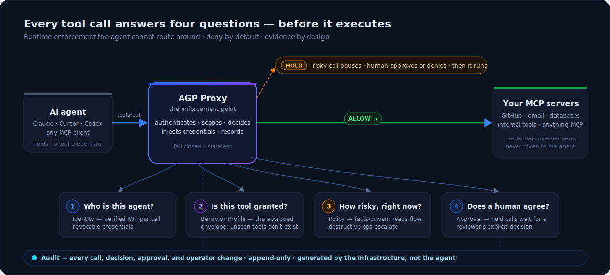
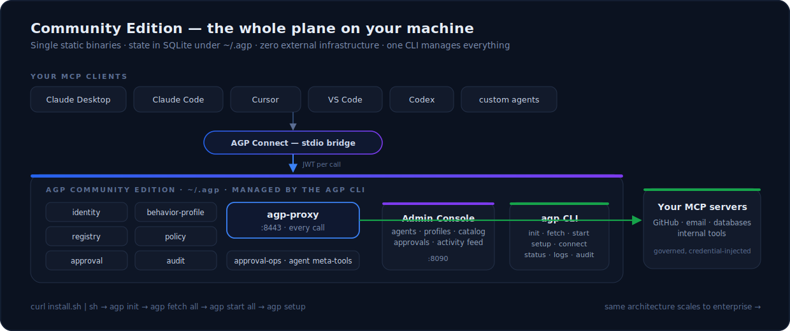

# AGP — Agent Governance Plane

**Community Edition** · by [Raksha AI](https://docs.getraksha.com) — *Operational Safety for Agentic AI*

AI agents are no longer just answering questions — they read your repositories, send your email, mutate your infrastructure, and touch your customers' data through MCP tools. Today, most of that happens with **no runtime governance at all**: every tool is visible to every agent, every call executes immediately, credentials sit next to the agent, and when something goes wrong there is no authoritative record of who did what, under whose approval, and why.

AGP is the missing layer: **runtime enforcement infrastructure that sits between your AI agents and every MCP tool they can invoke.** It is not an SDK, a prompt, or a convention the agent can ignore — it is a proxy the agent cannot route around. No call reaches a tool backend unless AGP has authenticated the agent, checked its approved operating envelope, evaluated policy, and made an explicit decision to allow it. Risky operations pause for human approval *before* they execute. Everything — every call, every decision, every operator change — lands in an append-only audit trail.

## Contents

- [How it operates](#how-it-operates)
- [What's in Community Edition](#whats-in-community-edition)
- [Quickstart](#quickstart)
  - [macOS & Linux](#macos--linux)
  - [Windows](#windows)
- [Who this protects](#who-this-protects)
- [Supported platforms](#supported-platforms)
- [Releases & verifying downloads](#releases--verifying-downloads)
- [What this repository is (and isn't)](#what-this-repository-is-and-isnt)
- [Documentation & support](#documentation--support)

## How it operates

Your agents (Claude Desktop, Claude Code, Cursor, VS Code, Codex, or your own) connect to AGP instead of connecting to MCP servers directly. Every tool call then passes through four questions — answered at runtime, on every call:



- **Deny by default.** An agent can only *see and call* tools explicitly granted in its approved behavior profile. Everything else doesn't exist from the agent's perspective — an agent cannot reason about, plan with, or invoke a capability it cannot see.
- **Risk-aware decisions.** The registry records facts about every tool (`read`, `write`, `delete`, `execute`); policy turns facts into decisions: reads flow, destructive operations **hold for human approval**. To the agent, a held call just looks like a slow tool call — a human approved or denied it in the middle.
- **Credential isolation.** Agents never hold tool credentials. The proxy injects them at request time, so a compromised or manipulated agent has nothing to exfiltrate.
- **Governance outside the model.** Prompts can be injected, models can be manipulated. AGP's decisions are made by infrastructure the agent cannot modify — and the audit record is generated by the enforcement layer itself, not by what the agent claims it did.

## What's in Community Edition

Everything runs on your machine: single static binaries, state in SQLite under `~/.agp`, zero external infrastructure. **Free-to-use** for everyone — individuals, startups, and enterprises alike — with no caps on agents, tools, or users and no time limit ([Community License](LICENSE.md)). **No telemetry by default** — nothing phones home; a governance layer should be as auditable in its own behavior as the agents it governs.

| Component | What it owns |
|---|---|
| **Proxy** | The enforcement point — every agent-to-tool call passes through it |
| **Identity** | Agent registration, credentials, short-lived JWT tokens |
| **Behavior Profile** | Each agent's approved operating envelope (tool grants, fail-closed) |
| **Registry** | The tool catalog: backends, schemas, operation facts |
| **Policy** | Facts-driven risk evaluation (OPA) — allow / deny / hold |
| **Approval** | Human-in-the-loop queue for held operations |
| **Audit** | Append-only event store: tool calls *and* operator changes |
| **Approval Ops** | Platform MCP server — agents list / proceed with / cancel their own held approvals |
| **Admin Console** | Web UI — agents, profiles, catalog, approvals, live activity feed |
| **`agp` CLI** | Installs, starts, and manages all of the above; bridges your MCP clients in |



## Quickstart

### macOS & Linux

```sh
# 1. Install the CLI
curl -fsSL https://raw.githubusercontent.com/getraksha/agp/main/install.sh | sh

# 2. Initialize ~/.agp (secrets, per-service config, CLI profile)
agp init

# 3. Download the service binaries for your platform
agp fetch all

# 4. Start the stack (8 services, health-checked)
agp start all
agp status

# 5. Create your first governed agent and connect a client
agp setup --agent-id my-agent --client claude-desktop
```

The admin console is at `http://localhost:8090` (credentials are printed by `agp init`). Register your MCP servers in the console's tool catalog, grant tools to your agent's behavior profile, and watch every call appear in the Activity feed — allowed, denied, or held for your approval.

### Windows

`install.sh` needs a POSIX shell, so on Windows install the CLI with **PowerShell** instead — then steps 2–5 are identical:

```powershell
# 1. Install the CLI (downloads, verifies checksum, adds to PATH for this session too)
irm https://raw.githubusercontent.com/getraksha/agp/main/install.ps1 | iex

# 2-5. Same as macOS/Linux
agp init
agp fetch all
agp start all
agp setup --agent-id my-agent --client claude-desktop
```

Prefer to install by hand? Download `agp_<version>_windows-<arch>.tar.gz` from the [releases page](https://github.com/getraksha/agp/releases/latest), extract `agp.exe` with `tar -xf`, and add its folder to your `PATH`.

## Who this protects

**Individuals:** you've connected agents to your email, files, and accounts. AGP means an agent that goes off the rails — prompt-injected, confused, or just over-eager — cannot quietly delete, send, or trade anything you didn't grant, and destructive operations wait for your explicit click.

**Teams and enterprises:** per-agent identity instead of shared credentials, least-privilege tool envelopes per environment, human escalation on high-risk operations, tenant-scoped visibility, and one authoritative audit trail that answers "which agent invoked which tool, under which profile, approved by whom" — the question incident response and compliance always ask. The same architecture scales from this laptop edition to enterprise deployment ([architecture docs](https://docs.getraksha.com)).

## Supported platforms

| OS      | Architectures   | Status       |
|---------|-----------------|--------------|
| macOS   | arm64, amd64    | supported    |
| Linux   | amd64, arm64    | supported    |
| Windows | amd64, arm64    | supported    |

On Windows, install the CLI with the PowerShell one-liner in the [Windows section above](#windows) (`install.sh` itself needs a POSIX shell).

## Releases & verifying downloads

Binaries are published as [GitHub Releases](https://github.com/getraksha/agp/releases). Each release ships a `manifest.json` (per-asset SHA-256 checksums, per-repo source provenance) and a `SHA256SUMS` file. The `agp` CLI and the install script verify checksums automatically before installing anything — a corrupted or tampered asset is refused.

To verify manually:

```sh
shasum -a 256 -c SHA256SUMS --ignore-missing
```

## What this repository is (and isn't)

This repository is the **distribution channel** for AGP Community Edition: this README, the install script, and the release binaries. AGP Community Edition is **free-to-use proprietary software** (like Docker Desktop or the Datadog Agent) — free to download and run, but **not open source**; the AGP source code is not public. The install script is MIT-licensed; the binaries are free to use under the [Community License](LICENSE.md). Hosted, team, and enterprise editions are available separately.

## Documentation & support

- [docs.getraksha.com](https://docs.getraksha.com) — architecture, concepts, threat models
- `agp help` — full CLI reference
- Questions, bug reports, feature requests: [GitHub Issues](https://github.com/getraksha/agp/issues)

---

© Raksha AI. AGP Community Edition is free to use under the [Community License](LICENSE.md).
